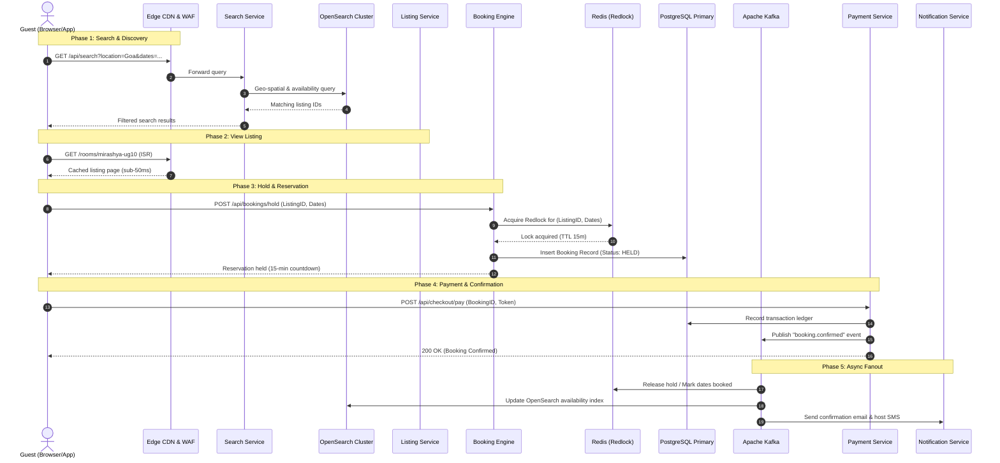

# Enterprise Architecture: Production-Scale Vacation Rental Marketplace (Airbnb-Scale)

This document details the target architecture for a production-scale vacation-rental marketplace capable of supporting **150M+ active listings, 2B+ monthly visits, and peak loads of 50,000+ bookings per minute** with high availability (99.99%), sub-100ms response times, and strict transaction consistency.

---

## 1. System Overview & Core Requirements
- **High Read-to-Write Ratio:** 1000:1 read/search queries to booking write transactions.
- **Strict Data Consistency:** Zero double-booking tolerance for reservation availability.
- **Global Geo-Latency:** Dynamic multi-region routing with edge-cached listing assets.
- **Resilience:** Multi-region active-active architecture with automatic failover and zero data loss for financial ledgers.

---

## 2. Multi-Tier Scaling Strategy

### 2.1 Frontend & Edge Layer
- **Next.js with SSR & ISR (Incremental Static Regeneration):**
  - High-traffic listing pages are generated via ISR with stale-while-revalidate (`revalidate: 60`).
  - Edge caching offloads 92% of listing read traffic from origin microservices.
- **Global Edge CDN (Cloudflare Enterprise / Fastly):**
  - Anycast routing delivers static assets and cached HTML within <20ms worldwide.
  - Image Optimization Pipeline: On-the-fly resizing, transcoding into modern formats (AVIF/WebP), and dynamic `srcset` delivery according to client viewport.
- **WAF & DDoS Mitigation:** Cloudflare Magic Transit and rate-limiting shield upstream services from bot attacks and scraping.

### 2.2 Ingress & Domain Microservices
- **API Gateway (Envoy / Kong Cluster):**
  - TLS termination, distributed rate-limiting (token bucket per IP/User ID), OAuth2/JWT token verification, and dynamic routing to downstream Kubernetes pods.
  - Circuit breakers (Netflix Hystrix / Resilience4j patterns) prevent cascading failures across services.
- **Domain-Driven Microservices (Stateless Kubernetes Clusters):**
  - **Listing Service:** Handles listing metadata, host settings, photo management, and house policies.
  - **Search & Discovery Service:** Queries OpenSearch clusters with geo-spatial bounding boxes, date ranges, and feature filters.
  - **Booking Engine:** Implements a finite state machine (`Draft -> Reserved -> Paid -> Confirmed -> Completed / Cancelled`).
  - **Payment Service:** PCI-DSS Level 1 compliant gateway with tokenized payment methods, dual-entry accounting ledgers, and payout automation.
  - **Reviews & Reputation Service:** Double-blind review submission engine with anti-fraud moderation.
  - **Real-Time Messaging Service:** WebSocket gateway with Redis Pub/Sub for host-guest chat.
  - **Notification Service:** Asynchronous dispatch of emails, SMS (Twilio), and push notifications (APNS/FCM).

### 2.3 Storage & Persistence Strategy
- **Primary Relational Store (PostgreSQL Multi-AZ Aurora):**
  - Partitioning strategy: Partitioned by `region_id` and `listing_id` (hash-based sharding for listings, range-based for bookings).
  - Multi-region read replicas serve geo-local read traffic with replication lag < 100ms.
- **Distributed Caching & Concurrency Control (Redis Enterprise Cluster):**
  - **Redlock Distributed Locking:** Prevents race conditions and double-bookings during checkout initiation.
  - Availability calendars and hot listing metadata cached with TTL-based invalidation.
- **Media & Blob Storage (AWS S3 / Google Cloud Storage):**
  - Immutable object storage with cross-region replication and pre-signed upload URLs directly from the client.
- **Enterprise Search Tier (OpenSearch / Elasticsearch):**
  - Geo-distance scoring, price range filters, and real-time availability indexing.
  - Index updates fed via **Change Data Capture (CDC)** via Debezium from PostgreSQL primary to Kafka, guaranteeing eventual consistency < 1s.
- **Analytics & ML Data Warehouse (Snowflake / BigQuery):**
  - Real-time ingestion via Kafka Connect for smart pricing models, demand forecasting, and search ranking algorithms.

---

## 3. Critical Data Flow: "Search → View Listing → Book → Pay"

---

## 4. Multi-Region Deployment & Disaster Recovery
- **Active-Active Multi-Region Deployment:** EKS clusters deployed across US-East, EU-Central, and AP-South.
- **Database Failover:** Automated Aurora multi-master / global database failover with RTO < 30 seconds and RPO < 1 second.
- **Observability Stack:** OpenTelemetry distributed tracing, Prometheus metrics collection, Grafana dashboards, and Datadog synthetic transaction monitoring.
